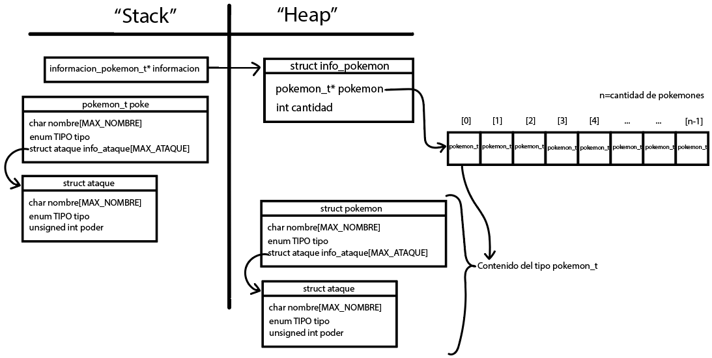

<div align="right">

</div>

# TP1

## Repositorio de Thiago Fernando Baez - 110703 - thiago_fer2@hotmail.com

- Para compilar:

```bash
make pruebas_chanutron
```

- Para ejecutar:

```bash
./pruebas_chanutron
```

- Para ejecutar con valgrind:
```bash
./valgrind pruebas_chanutron
```
---
##  Funcionamiento

Explicación de cómo funcionan las estructuras desarrolladas en el TP y el funcionamiento general del mismo.

Aclarar en esta parte todas las decisiones que se tomaron al realizar el TP, cosas que no se aclaren en el enunciado, fragmentos de código que necesiten explicación extra, etc.

Incluír **EN TODOS LOS TPS** los diagramas relevantes al problema (mayormente diagramas de memoria para explicar las estructuras, pero se pueden utilizar otros diagramas si es necesario).

### Función pokemon_cargar_archivo()

El programa inicia con la función `pokemon_cargar_archivo` que recibe por referencia un string con el path del archivo a trabajar. Se verifica el nombre del archivo a abrir.  Si este no es nulo (`NULL`), se procede a intentar abrir el archivo de texto. En caso de éxito, comienza el proceso de lectura del mismo, en el que se encuentra la información de ciertos pokemones. El archivo a leer debe estar estructurado de la siguiente manera: 

```
nombre;tipo
ataque1;tipo;poder
ataque2;tipo;poder
ataque3;tipo;poder
nombre;tipo
ataque1;tipo;poder
ataque2;tipo;poder
ataque3;tipo;poder
```

Para poder guardar la información requerida, se utilizan tres estructuras:
- **struct info_pokemon**: Esta estructura contiene una variable entera (int) con la cantidad de pokemones leídos, y un vector dinámico de estructuras struct pokemón.
- **struct pokemon**: Contiene los datos básicos de un pokemon, nombre (string), su tipo (enum) y un vector con 3 estructuras (struct ataque), una para cada ataque que posee el pokemon.
- **struct ataque**: En esta se aloja la información del ataque, nombre (string), tipo (enum) y poder (unsigned int).

Por la necesidad de crear estructuras que "sobrevivan" al acabar la función, se procede a crear un informacion_pokemon_t*, puntero que contendrá la dirección de memoria que devuelve `malloc()`. Esta función, perteneciente a la librería `stdlib.h`, asigna bloques de memoria del tamaño solicitado por parámetro (el tamaño se especifica en bytes). Devuelve un void pointer a la zona de memoria concedida (en caso de no poder asignarse, devuelve `NULL`).
Para poder guardar la dirección de memoria que retorna `malloc()`, se realiza la conversión de tipo de dato (casteo) anteponiendo (informacion_pokemon_t *), de modo que el compilador interprete que la función está retornando un puntero de ese tipo.
A diferencia de las variables que usualmente creamos, que son almacenadas en un lugar de la memoria llamado "Stack" y son reguladas automáticamente por el sistema operativo (se libera el espacio utilizado al terminar el programa), cuando se usa la función `malloc()`, se están reservando bloques de memoria dentro de un lugar en la memoria RAM llamado "Heap", en el cual las variables que se crean son reguladas por el programador, y se deben liberar dichos bloques una vez que no se necesiten más. Esta acción de liberar la zona de memoria asignada por `malloc()`, se realiza a través de la función `free()`, que más tarde se utilizará al terminar el programa.

<div align="center">

</div>

Una vez asignado el espacio en memoria, se inicializa la cantidad de pokemones disponibles en 0 y se comienza con la lectura del archivo. Se utiliza la función `fscanf()` para leer una línea del archivo a la vez, y posteriormente guardarla en un string. Antepongo a la función `(void)!` ya que esta retorna un int, pero como no es necesario y a la hora de compilar aparece como un error no guardarlo, se utiliza ese casteo.
Se comprueba que al leer una línea, no se haya llegado al final del archivo, ya que si esto fuera afirmativo, el archivo no tendría información válida y/o completa sobre un pokemon.

Una vez leída la primer línea, se entra en un ciclo `while()` el cual iterará mientras no se llegue al final del archivo.
Se cuenta la cantidad de `';'` que posee cada una de las líneas. Para corroborar que el formato del archivo sea correcto, debe haber (1) `';'` en el primer renglón (donde se ubica el nombre y tipo del pokemon), seguido por tres renglones con (2) `';'` (donde se ubican los datos de los ataques correspondientes a dicho pokemon). Para poder separar cada característica o atributo del pokemon, se utiliza la función `sscanf()` que lee datos desde una cadena de texto, siguiendo un cierto código de formato. En este caso, se lee primero el nombre y el tipo del pokemon, luego los atributos de los 3 ataques correspondientes. Los datos leídos desde el string son cargados a una estructura local llamada `"poke"`, la cual llevará los datos de cada una de las líneas leídas. En el caso de que la lectura falle por algún error en el formato o por la falta de datos, se cierra el archivo y se retornará el puntero a la estructura info_pokemon con los pokemones leídos correctamente hasta el momento (en caso de no poder leer ninguno, se libera el bloque de memoria reservado en el heap y se retorna `NULL`).

Si la lectura del pokemon fue exitosa, se procede a llamar a la función `realloc()`. Esta función permite redimensionar el espacio asignado en memoria. Se le pasan dos parámetros, un puntero al bloque de memoria asignado previamente y el nuevo tamaño del bloque de memoria. Devuelve un puntero void al bloque de memoria reasignado. Si no hay suficiente memoria disponible para expandir el bloque al tamaño especificado, el bloque original se deja sin cambios y se devuelve `NULL`. Al igual que en `malloc()`, la función retorna un void pointer, por lo que se tiene que castear al tipo de dato requerido (en este caso, un pokemon_t*).

En la primer llamada que se realiza a la función `realloc()`, se le pasa un puntero `NULL` y el tamaño en bytes de la estructura `struct pokemon`. Si el puntero es `NULL` y el tamaño solicitado es mayor a cero, `realloc()` se comporta de manera equivalente a `malloc()`.

Una vez terminada la lectura y asignación de memoria para el pokemon leído, si el formato y los datos son correctos, se procede a guardar la estructura `poke` en el vector de pokemones. El primer pokemon se ubicará en la posición [`0`] del vector, el segundo en [`1`] y así sucesivamente hasta [`cantidad-1`]. Luego seguirá iterando hasta leer todos los pokemones, finalmente se cierra el archivo con la función `fclose()` y se retorna un puntero a la información leída al módulo invocante.

### Función pokemon_buscar()
Para esta función, se recibe como parámetro, un puntero de tipo informacion_pokemon_t*, que contiene la dirección de memoria donde se alojan los datos de los pokemones (en el heap), y también el nombre de un pokemon a buscar (string).
Para esta función se implementa el algoritmo de `"Búsqueda Secuencial"` el cual consiste en un ciclo `while()`, el cual itera mientras no encuentre al pokemon y mientras el contador `i` no supere el máximo lógico del vector. Se hace uso de la función `strcmp()` para comparar el nombre de cada pokemon con el nombre buscado.
En caso de encontrar el pokemon buscado, se retorna al módulo invocante la dirección de memoria donde se aloja dicho pokemon. En caso de no encontrarlo, se devuelve `NULL`.

### Función pokemon_cantidad()
Esta función es simple, retorna la cantidad de pokemones disponibles. En el caso de que el puntero que recibe sea `NULL`, retorna `0` al módulo invocante.

### Función pokemon_nombre()
Esta función retorna el nombre de un pokemon, en caso de no encontrarlo, retorna `NULL` al módulo invocante.

### Función pokemon_tipo()
Esta función recibe un pokemon, y retorna el tipo de dicho pokemon. En caso de ser `NULL`, retorna el tipo `NORMAL`.

### Función pokemon_buscar_ataque()
Esta función recibe un pokemon y el nombre de un ataque. Se debe retornar al módulo invocante un puntero a la información de dicho ataque. De igual forma que para la función `pokemon_buscar()`, se implementa `"Búsqueda Secuencial"` y se realiza la comparación con `strcmp()`. En caso de no encontrar el ataque buscado, se retorna `NULL`.

### Función con_cada_pokemon()
Esta función recibe un puntero a la información de un pokemon (struct pokemon), un puntero a función y un void pointer que tiene que ser pasado a la función como segundo parámetro. Para esta función se requiere que el vector de pokemones esté ordenado alfabéticamente, por lo que se realizó una función para ordenar el vector de pokemones siguiendo este requisito (se hablará más abajo acerca de esta función y sobre la complejidad computacional que esta implica).
Se valida que ninguno de los parámetros sea nulo y se procede a entrar en un ciclo iterativo `for()` dentro del cual se le aplicará la función `(*f)` a cada uno de los ataques del pokemon. Se retorna al módulo invocante la cantidad de veces que se aplicó esta función a los pokemones.


### Función con_cada_ataque()
De manera similar a la anterior función, se recibe un puntero a función, un void pointer y un pokemon_t*. Se aplica una función `(*f)` a cada uno de los ataques del pokemon recibido. Se debe verificar que ninguno de los punteros que recibe la función sean `NULL`, en caso de que haya algun puntero nulo, se retorna `0`. Se utiliza un `for()` para iterar tres veces, aplicando a cada ataque del pokemon la función `(*f)` pasada por referencia. Retorna al módulo invocante la cantidad de veces que se aplicó la función.


### Función pokemon_destruir_todo()
Retomando el tema de las funciones `malloc()` y `realloc()`, las cuales dijimos que asignaban bloques de memoria contiguos ubicados en el heap, y que para deshacerse de los bloques que ya no se necesitan, se deben liberarlos manualmente, se utiliza una función llamada `free()`. Esta recibe un puntero a la dirección de memoria donde se encuentra el bloque que se reservó anteriormente en alguna línea del programa. En este caso, como las reservas que se hicieron fueron dos (una para el `struct info_pokemon` y otra para el vector de pokemones) se debe liberar primero el vector de pokemones, ya que la dirección de memoria a la que apunta, se encuentra dentro de la estructura `struct info_pokemon`. En el caso de que se libere primero `struct info_pokemon`, se perdería la referencia hacia el vector de pokemones. Este quedaría completamente perdido en la memoria y no se tendría forma de liberar esos bloques utilizados. 

### Fin del Trabajo Práctico y conclusión
Habiendo finalizado la escritura del código, se compila con `make pruebas_chanutron` y posteriormente se lo ejecuta con `valgrind ./pruebas_chanutron`. La herramienta valgrind mostrará el sumario del heap y de errores. Se puede observar que corrió todas las pruebas implementadas por la cátedra y no hubo perdidas de memoria al terminar la ejecución. Se hizo uso de la herramienta clang-format para verificar que el estilo de código corresponda al del kernel de Linux.


## Respuestas a las preguntas teóricas

#### Explicar cómo se logra que los pokemon queden ordenados alfabéticamente y cuál es el costo computacional de esta operación.

Para ordenar los pokemones se implemento un algoritmo de ordenamiento llamado "Ordenamiento por Burbujeo". En este caso, el algoritmo de ordenamiento de burbuja se utiliza para comparar los nombres de los Pokemones, y ordenarlo alfabéticamente.
El algoritmo funciona comparando dos nombres contiguos en el vector, es decir, compara el nombre del pokemon que se encuentra en la posición `[0]` con el nombre del pokemon en `[1]`. Si el nombre `[0]` es mayor alfabéticamente que en `[1]`, se procede a realizar el cambio: 
- Se guarda el pokemon de `[0]` en una variable auxiliar
- El pokemon que estaba en `[1]` ahora se mueve a `[0]`
- Ahora, en `[1]` se guarda el pokemon auxiliar (anteriormente en `[0]`)

Una vez realizado el cambio, se comparan los pokemones siguientes, los posicionados en`[1]` y `[2]`. Asi sucesivamente hasta comparar los últimos dos del vector.
La complejidad computacional que implica este algoritmo es de O(n²). 
Para poder entender mejor como funciona el algoritmo, observar el gif insertado abajo.
<div align="left">

</div>

#### Explicar con diagramas la disposición de los diferentes elementos en memoria para las diferentes operaciones implementadas.
